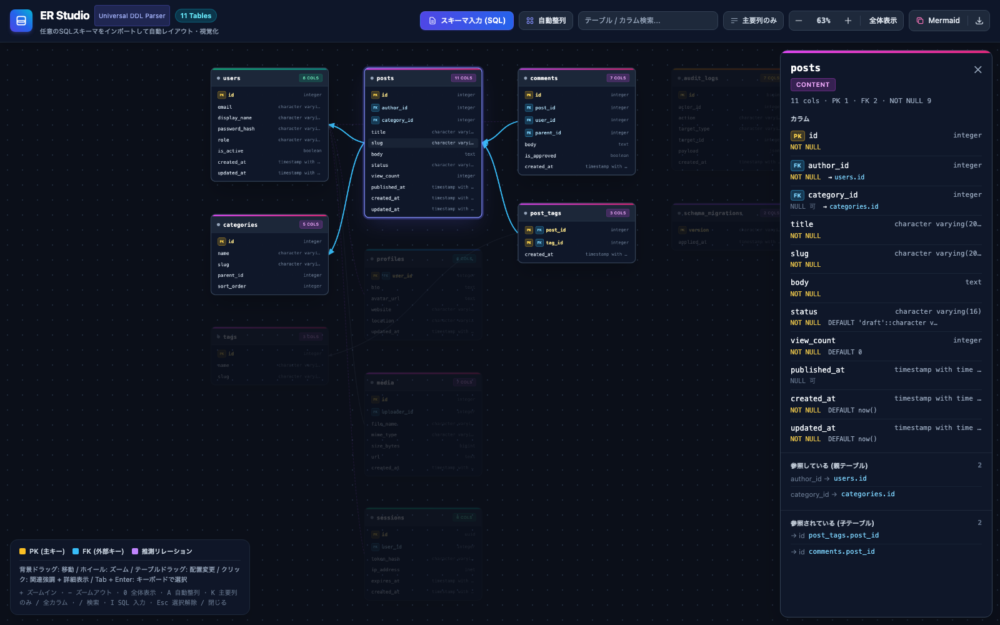
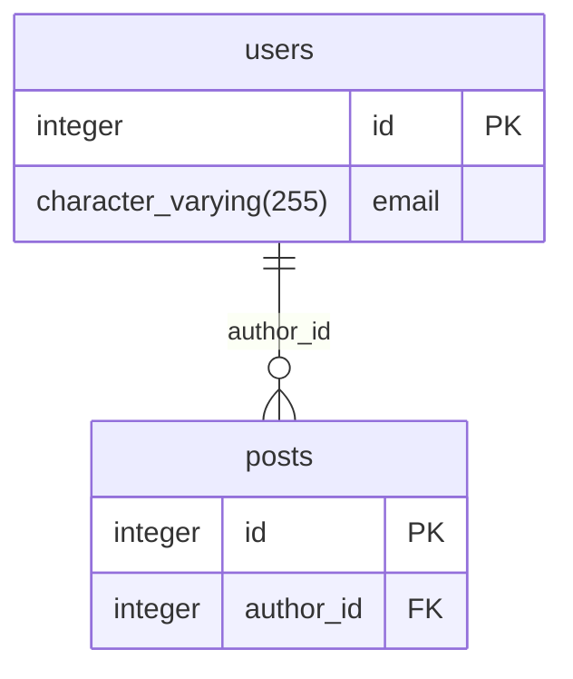

# ER Studio — SQL DDL から ER 図を自動生成するブラウザアプリ

`CREATE TABLE` / `ALTER TABLE` 文を貼り付けるだけで、テーブル同士のリレーションを解析して ER 図として可視化します。
ビルド不要の静的サイト (HTML / CSS / JavaScript) で、ブラウザだけで動作します。

**デモ:** https://ojagao.github.io/er-visualizer/



## 主な機能

- **DDL の解析** — PostgreSQL (`pg_dump` 形式を含む) / MySQL / SQLite などの `CREATE TABLE` と `ALTER TABLE ... ADD CONSTRAINT` を解析。インライン / アウトオブラインの PK・FK、複合キー、`CHECK`、`DEFAULT`、コメント、スキーマ名 (`public.users`) に対応
- **リレーションの推測** — FK 制約が無くても `user_id → users.id` のような命名規則から関係を推測して点線で表示 (オン / オフ切替可)
- **自動レイアウト** — 参照される側 (親) を左、参照する側 (子) を右に階層配置。孤立テーブルは右端にまとめ、カード同士が重ならないよう高さを考慮
- **インタラクション** — 背景ドラッグでパン、ホイールでズーム、カードのドラッグで配置変更、クリックで関連テーブルと接続線をハイライト
- **検索 / 表示切替** — テーブル名・カラム名の検索 (一致件数を表示、Enter で一致テーブルへ順にジャンプ)、PK / FK のみを表示するコンパクトモード
- **詳細パネル** — テーブルをクリックすると右側にカラムの `NOT NULL` / `DEFAULT` / `UNIQUE` / FK 参照先、参照している・されているテーブルの一覧を表示。関連テーブルへワンクリックで移動
- **ファイル読み込み** — `.sql` / `.ddl` / `.txt` をファイル選択またはドラッグ&ドロップで読み込み。本アプリでエクスポートした JSON も復元可能
- **エクスポート** — Mermaid `erDiagram` 記法をクリップボードへコピー (Markdown に貼り付けて図として表示)、解析結果を JSON で保存
- **自動保存** — SQL・カード配置・ズーム位置・表示モードをブラウザ (localStorage) に保存し、次回開いたときに復元
- **キーボード操作** — ショートカット (下表) と、Tab でカードを選んで Enter で選択するキーボード操作に対応

## 使い方

1. デモサイトを開く、または `index.html` をブラウザで直接開く
2. 「スキーマ入力 (SQL)」ボタンからモーダルを開き、DDL を貼り付ける (サンプルとして「ブログ / CMS」「EC ショップ」を用意)
3. 「ER 図を生成する」を押すと自動レイアウトされた ER 図が表示される

| 操作 | 内容 |
| --- | --- |
| 背景をドラッグ | キャンバスの移動 |
| マウスホイール | カーソル位置を中心にズーム (感度はズーム操作群の「感度」セレクターで 5 段階から選択。選択はブラウザに保存) |
| カードをドラッグ | テーブルの配置変更 (接続線が追従) |
| カードをクリック | そのテーブルと関連するテーブル・接続線を強調 |
| 自動整列 | 配置をリセットして再レイアウト |
| 全体表示 | すべてのテーブルが収まるようズーム調整 |
| 検索欄で Enter / Shift+Enter | 一致テーブルへ順に (逆順に) ジャンプ |
| ファイルをドロップ | 画面のどこにでも SQL / JSON ファイルをドロップして読み込み |

### キーボードショートカット

| キー | 操作 |
| --- | --- |
| `+` / `-` | ズームイン / ズームアウト |
| `0` | 全体表示 |
| `A` | 自動整列 |
| `K` | 主要列のみ / 全カラム 切替 |
| `/` | 検索欄にフォーカス |
| `I` | SQL 入力モーダルを開く |
| `Esc` | 検索をクリア / 選択解除 / モーダルを閉じる |
| `Tab` → `Enter` / `Space` | カードを選んで選択トグル |

### Mermaid エクスポート

ツールバーの「Mermaid」ボタンで、解析結果を `erDiagram` 記法としてクリップボードにコピーします。FK 列の `NOT NULL` / `UNIQUE` / 単独 PK からカーディナリティを決め、推測リレーションは点線で出力します。



### 凡例

接続線は子 (FK を持つ側) から親 (参照される側) へ引き、両端の記号で多重度を表します (クロウズフット記法)。線の色は種類で変えません。

| 表示 | 意味 |
| --- | --- |
| 黄色バッジ `PK` | 主キー |
| 青色バッジ `FK` | 外部キー |
| バッジ `N:N` | 中間テーブル (PK がすべて FK で 2 つのテーブルを結ぶ多対多) |
| 線端 `─┤` (縦棒) | 1 (FK が NOT NULL の親側) |
| 線端 `─○┤` (丸 + 縦棒) | 0 または 1 (NULL 許容の FK の親側、1 対 1 の子側) |
| 線端 `─○<` (丸 + 三叉) | 多 (0 以上) |
| 実線 | DDL で明示された外部キー |
| 点線 | 命名規則から推測したリレーション |

## 対応している構文の例

```sql
-- インライン制約
CREATE TABLE orders (
    id SERIAL PRIMARY KEY,
    user_id INTEGER NOT NULL REFERENCES users(id),
    total_amount NUMERIC(12, 2) NOT NULL
);

-- アウトオブライン制約 / 複合キー
CREATE TABLE post_tags (
    post_id INTEGER NOT NULL,
    tag_id INTEGER NOT NULL,
    PRIMARY KEY (post_id, tag_id),
    CONSTRAINT fk_post FOREIGN KEY (post_id) REFERENCES posts (id)
);

-- pg_dump 形式 (ALTER TABLE で後付け)
ALTER TABLE ONLY public.comments ADD CONSTRAINT comments_pkey PRIMARY KEY (id);
ALTER TABLE ONLY public.comments ADD CONSTRAINT comments_post_id_fkey
    FOREIGN KEY (post_id) REFERENCES public.posts(id) ON DELETE CASCADE;

-- MySQL
CREATE TABLE IF NOT EXISTS `products` (
    `id` INT AUTO_INCREMENT PRIMARY KEY,
    `category_id` INT NOT NULL,
    INDEX idx_category (category_id),
    FOREIGN KEY (category_id) REFERENCES `categories` (id)
);
```

## ローカルでの実行

ビルドは不要です。`index.html` をブラウザで開くだけで動作します。
ローカルサーバーで確認する場合:

```bash
npm run serve   # http://localhost:8080
```

### テスト

パーサー・レイアウト・ズーム計算のユニットテストを Node.js 標準の `node:test` で実行します (追加パッケージ不要、Node.js 18 以上)。

```bash
npm test
```

## ディレクトリ構成

```
.
├── index.html               # マークアップ
├── css/styles.css           # カスタムスタイル (Tailwind CDN を補完)
├── js/
│   ├── config.js            # 定数 (カード寸法・ズーム感度・レイアウト間隔・各種上限)
│   ├── presets.js           # サンプル DDL
│   ├── ddl-parser.js        # DDL パーサー (CREATE / ALTER 解析、FK 推測、カテゴリー付与)
│   ├── auto-layout.js       # 階層グリッド自動レイアウト
│   ├── state.js             # アプリ状態 (イミュータブル更新・購読)
│   ├── persistence.js       # 作業状態の自動保存・復元 (localStorage)
│   ├── dom.js               # DOM 参照
│   ├── utils.js             # HTML エスケープ・寸法推定・検索判定・ダウンロード
│   ├── toast.js             # トースト通知
│   ├── mermaid-export.js    # Mermaid erDiagram 変換・コピー
│   ├── card-template.js     # テーブルカードの HTML 生成
│   ├── card-drag.js         # カードのドラッグ移動
│   ├── detail-panel.js      # 選択テーブルの詳細パネル
│   ├── render-tables.js     # カード描画
│   ├── render-connections.js# SVG 接続線描画
│   ├── diagram.js           # 描画オーケストレーション
│   ├── viewport.js          # パン・ズーム・全体表示・テーブル中央表示
│   ├── search-navigation.js # 検索の一致件数と Enter ジャンプ
│   ├── schema-modal.js      # SQL 入力モーダル (フォーカス管理含む)
│   ├── keyboard-shortcuts.js# キーボードショートカット
│   ├── file-import.js       # SQL / JSON ファイルの読み込み
│   └── app.js               # ツールバー配線・初期化
└── tests/                   # node:test によるユニットテスト
```

## 技術メモ

- スタイリングは [Tailwind CSS](https://tailwindcss.com/) の Play CDN を使用しているため、オフラインではスタイルが適用されません
- ES モジュールは `file://` で開くとブロックされるため、通常の `<script>` を依存順に読み込む構成にしています
- 状態は直接変更せず、常に新しいオブジェクトへ差し替える方針で実装しています
- 自動保存はブラウザの localStorage に 1 キーのみ上書き保存します (履歴は溜まりません)。SQL 本文が 1 MB を超える場合は保存をスキップします。保存内容は SQL 入力モーダルの「初期状態に戻す」で消去できます
